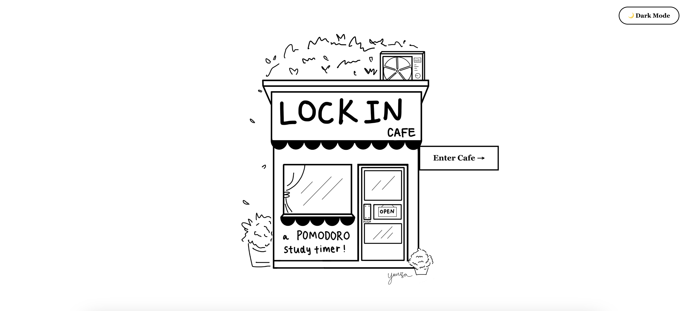
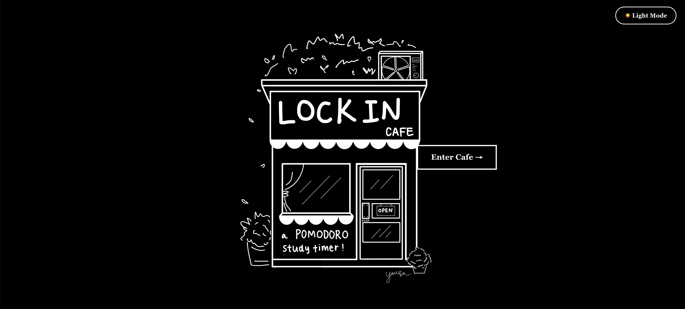
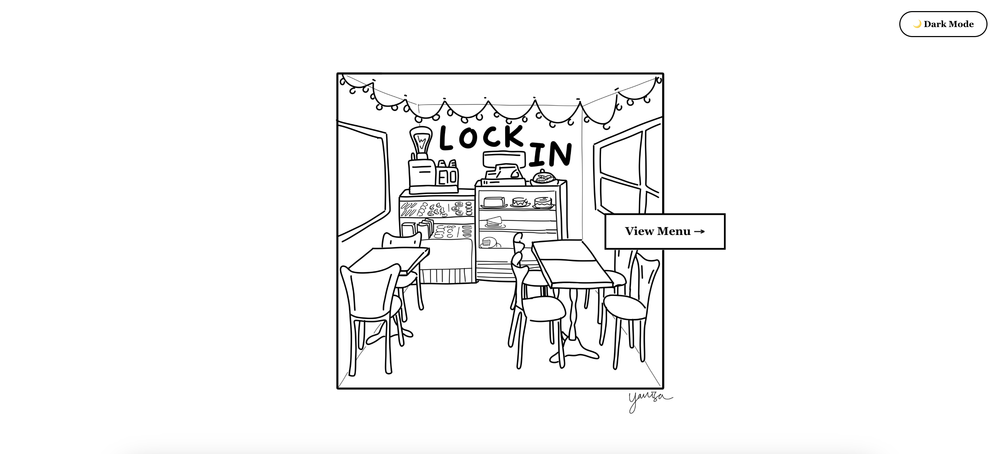
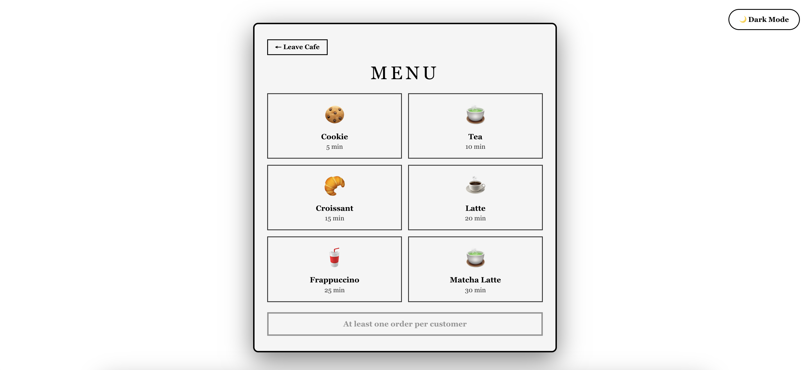

# ☕️ Pomodoro Timer Cafe

A cafe-themed pomodoro timer

## 🌟 Features

### Core Functionality
- **Timer** - 5, 10, 15, 20, 25, and 30 minute timer options for users who want to study/work using the Pomodoro method (doing work in time intervals).

### Design Features
- **Day/Night Mode Toggle** - Switch between light and dark themes with custom backgrounds
- **Custom Pixel Art Backgrounds** - Hand-crafted cafe-themed backgrounds for both light and dark modes
- **Responsive Design** - Fully responsive layout that works on desktop and mobile devices
- **Smooth Animations** - Polished UI with smooth transitions and popup animations

## 🛠️ Tech Stack
- **React** - Frontend framework
- **JavaScript (ES6+)** - Programming language
- **CSS3** - Styling with custom animations

## 🚀 Deployment

This app is deployed on Netlify. See it [here](https://yanisa-pomodoro.netlify.app).

## 📸 Screenshots

### Landing Page (Cafe Exterior)

### Cafe Interior (in light mode)

### Timer Menu

## 🎨 Custom Assets

All background images and designs were custom-made for this application:
- `inside-light.jpg` - Custom cafe interior background (light mode)
- `inside-dark.jpg` - Custom cafe interior background (dark mode)
- `outside-light.jpg` - Custom cafe exterior background (light mode)
- `outside-dark.jpg` - Custom cafe exterior background (dark mode)

## 📱 Usage

**Toggle Day/Night Mode**: Click the ☀️/🌙 button to switch between light and dark modes

## 👩‍💻 Author

**Yanisa Srisa-ard**
- Portfolio: [yanisa.netlify.app](https://yanisa.netlify.app)
- GitHub: [@yanisasri](https://github.com/yanisasri)
- LinkedIn: [linkedin.com/in/yanisa](https://linkedin.com/in/yanisa)

## 🙏 Acknowledgments
- Custom pixel art backgrounds designed and created by Yanisa Srisa-ard

## 📝 Notes

This is a hobby project created to practice React development. All designs, including the cafe backgrounds, were custom-made for this application.